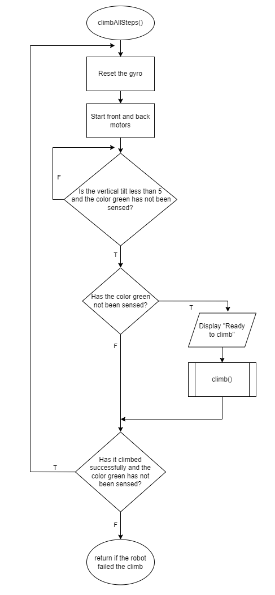
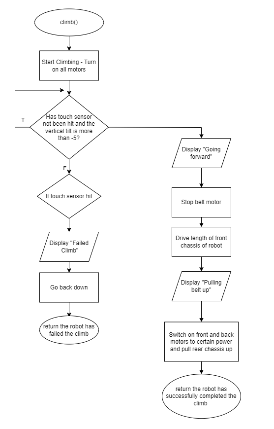
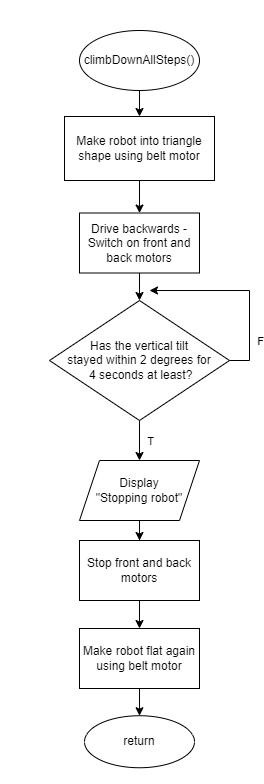

# Stair_Climber
A stair climbing robot made for our `MTE 100 and MTE 121` courses as a final project, that is able to autonomously deliver objects by climbing up and down stairs. It is purposed to help those who need something and are unable to traverse down stairs to get it, such as those with disabilities or those who are injured.

Procedure:
- Start upon voice activation. (a loud noise, etc.)
- Climb variable heights and number of stairs, with minimal movement of the object in the carriage.
- Detect the colour of the ground and stop when the colour green is seen meaning it is in the safe zone.
- Once user has taken the object, robot will travel down the stairs until there are no more stairs.

The robot will also:
- Play sounds and display messages at certain checkpoints.

Here is a short gif to demo the robot:

Checkout the [full demo video](https://www.youtube.com/watch?v=L8bMRJ6BMCM) and the demo from [a different view](https://www.youtube.com/watch?v=oZTXrjerqaw).

## Pictures

### Initial Design

## Flowcharts
Main flowchart:

Climb all steps flowchart:

Climb one step flowchart:

Climb down all steps flowchart:

